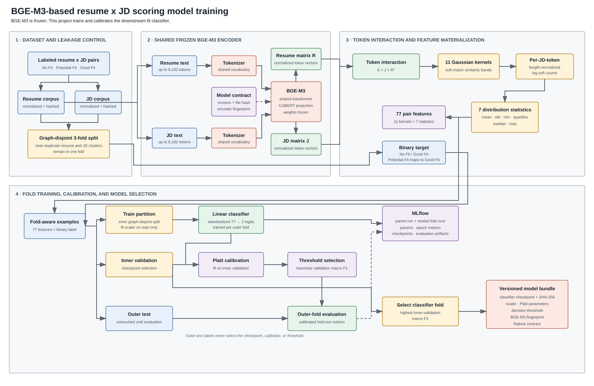

# Work while you Work

Work while you Work is a browser-based job application tracker with an ML "system" for resume and JD matching. It captures job details from supported job boards, allows tracking applications in DB of choice (I use Notion btw 😀), and scores a selected resume against the JD before you can submit an application.

I built this to make my job search easier by keeping application tracking and resume matching in one place.


# What is different here?
Fair question and the answer is subjective. There are already plenty of job trackers, and tracking an application is a pretty trivial problem to solve. But, I built this for two main reasons:

1. Existing trackers did not capture the fields I cared about or provide the filtering needed to run some complex analytics.
2. Most resume matchers stop at _semantic similarity_. They may extract entities and skills from a job description using NER, or embed the resume and job description using some off-the-shelf models and compare them (mostly using cosine similarity). That however answers the question, "whether two documents look related?", but it does not necessarily reflect hiring outcomes. _A resume can appear to be a strong match and still get rejected_.

I wanted to explore a scoring system that could eventually use application outcomes as feedback instead.

## Model architecture and training

[](assets/architecture.drawio)


### Why BGE-M3?

[BGE-M3](https://huggingface.co/BAAI/bge-m3) is an embedding model from BAAI built for three retrieval modes: dense vectors, sparse lexical matching, and ColBERT-style multi-vector retrieval. It supports inputs up to 8,192 tokens and more than 100 languages. The design is described in the [BGE-M3 paper](https://arxiv.org/abs/2402.03216).

This project uses bge-m3 until the multi-vector output. Instead of reducing a resume or job description to one vector, BGE-M3 produces a contextual vector for each token. That preserves local interactions such as a job requirement matching one specific resume phrase. The model then builds the full resume/job token-similarity matrix $\rarr$ applies 11 Gaussian kernels $\rarr$ and summarizes each kernel response with seven distribution statistics. The result is a __77-feature__ vector for a small linear classifier.

BGE-M3 remains frozen during training. The learned part is the `77 -> 2` classifier, followed by [Platt scaling](https://en.wikipedia.org/wiki/Platt_scaling).


## Tracking impressions

__MLflow__ is used here to track the training and evaluation lifecycle:

- Training creates a parent run with nested runs for each fold and records training and eval related artifacts and metadata.
- Calibration and held-out evaluation are attached to the originating runs, which keeps the selected checkpoint traceable to its split and metrics.
- The selected classifier can be registered as a versioned model with a `champion` alias.

## Evaluation

On 31,333 graph-disjoint outer-test pairs, the model reached:

| Metric | Result |
| --- | ---: |
| ROC-AUC | 0.7868 |
| Accuracy at validation-selected thresholds | 0.7531 |
| Macro F1 at validation-selected thresholds | 0.6952 |


## Project

```text
extension/  # browser capture and application UI
service/    # HTTP API, queue worker, Notion persistence, and scoring clients
ml/         # dataset processing, model training, evaluation, and inference package
deploy/     # Hugging Face and MLflow release scripts
```

## Local setup

Requirements:

- Python 3.12 and uv
- Node.js for the extension tests
- Docker Compose for the application stack
- Notion and Hugging Face credentials for the live integrations

Install the ML environment and run the test suites:

```bash
make setup
make test
```
```bash
make up
```

```bash
docker compose --profile local-scoring up -d --build
```
